# UniVIP: A Unified Framework for Self-Supervised Visual Pre-training

This readme file is an outcome of the [CENG502 (Spring 2023)](https://ceng.metu.edu.tr/~skalkan/ADL/) project for reproducing a paper without an implementation. See [CENG502 (Spring 20223) Project List](https://github.com/CENG502-Projects/CENG502-Spring2023) for a complete list of all paper reproduction projects.

# 1. Introduction
Self supervised learning aims to train generalizable models without labels by using the data intrinsic learning signals. There is a significant need for labelled data for most computer vision tasks, where object segmentation can be one of the most tedious ones. 

Self-supervised learning methods has achieved on-par or even better results than its supervised counterparts in recent years (also in NLP). However, most of the available methods focus on iconic datasets (with single objects centered in the image) like ImageNet. For classification tasks these methods might be sufficient but tasks like object detection and segmentation require to learn more detailed representations by taking into account multiple objects in images in varying sizes. For the representations to be useful they have to be taking into account non-iconic samples which are common in datasets like COCO.

One popular method that tries to learn similar representations for differently augmented views of the same image is BYOL []. Applying it's approach to COCO results in irrelevant cropped regions like below:
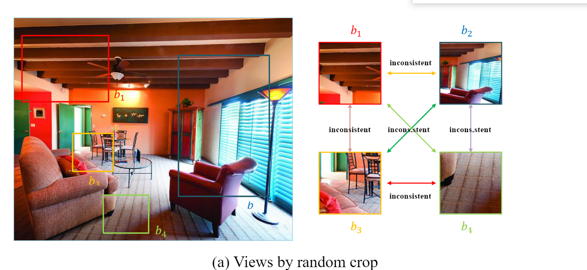

It can be seen that it is very difficult for these boxes to contain consistent image crops, where the model can learn to relate object parts of the same object. A different approach is necessar here which is aware of multiple objects in varying sizes and whole scene in general.

The paper UniVIP (CVPR 2022) tries to solve this problem. And this repository tries to reprodoce their method based on their desciptions in the paper.

## 1.1. Paper summary
Unlike BYOL, UniVIP tries to learn relation between scenes, between instances and between scenes and instances. This explained well in the image below:

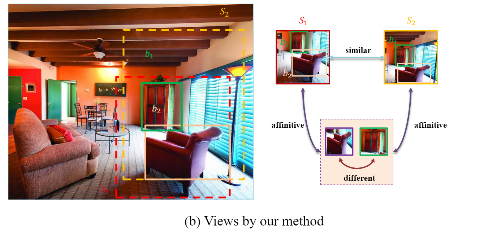

In the image, scenes are similar, object are part of (related) to scenes, and each object is different from each other. This would be indeed a useful learning guide for SSL. Their contributions are towards accomplishing these:

1. Rather than selecting fully random crops, selecting two random scenes with an overlap (where some obects reside) can solve the inconsistency problem in non-iconic datasets like COCO.
2. If available instances in the image are known, toghether with the random crops (scenes), they utilize scene-to-scene similarity, instances to scene similarity and instances to instances dissimilarity.

With these updated they achieve superior results both in single-centric (iconic) datasets like imagenet (classification) and non-iconic datasets like COCO and on multiple different downstream tasks.

It is important to mention that, in the literature there is a paper which BYOL is very related (might be inspired from) called ORL (Unsuperrvised Object-Level Representation Learning from Scene Images) [].

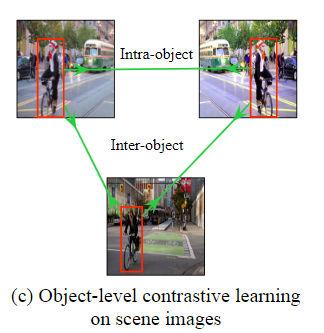

Basically they use BYOL to generate representations of image which they later pair into groups with k-nearest neighbour method. Then with an unsupervised region proposal algorithm (selective search) they generate RoIs. Next, the pre-trained model is to find top-ranked RoI pairs, on top of which a model is trained which they call object level representation learning. This three stage method is smartly simplified by UniVIP.

# 2. The method and my interpretation

## 2.1. The original method

The paper uses directly BYOL's approach to generate random crops from images with slight modifications. The steps are  explained below.

## 2.1.1. Scene to scene

For an image x, two different views (scenes) are generated by applying different augmentations called T1 and T2:

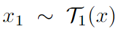. 

These views are fed to both the online and target network which are not perfectly symmetric (online network has an addional predictor network appended and target network is the exponential moving average of the online network). These two different representations are being forced to be close to each other wich the cosine similiary loss (which can be represented with mean square error):

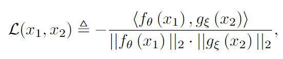

Both images with different augmentations are fed to both networks seperately and the symmetric losses are added up to update the online network (teach). Here is final scene to scene loss:

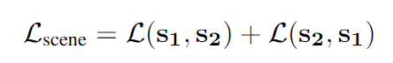

But scenes are selected if their overlap contain K number of objects (proposal boxes). This forces scenes to be similar, as explained in the next part in more detail.

## 2.1.2. Scene to instance
An unsupervised instance proposal algorithm called selective search is applied to images with:
- 0.5 IoU threshold
- 1/3 to 3/1 ratio aspect ratio limit
- minimum size being at least 64 pixels constraint
  
Then, scenes are proposed as in the first step like BYOL, but it is required that these scenes have an overlap where K box proposals are fully included. For 20 iterations, different random views (scenes) are generated if this criterion was not fullfilled. 

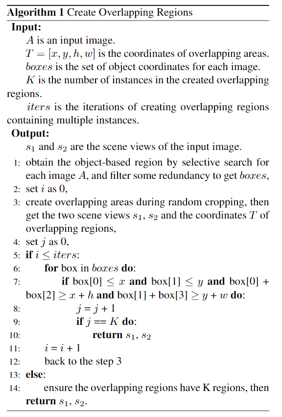

Finally, as a backup plan, random boxes are generated considering the 3 constraints listed above. 

The instances in the overlaps are cropped from the original image and resized to K 96x96 regions. These K instances are fed to the online network and the output K representation vectors are concatenated and fed to a linear layer to be mapped to a vector of equal size as the scene's representation:

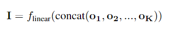

Then, the same cosine similiarity loss is used to calculate the difference between these representations as below:

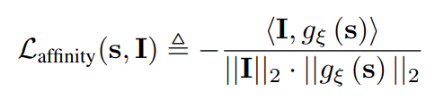

Differently, scenes are only fed to the target network while instances are fed to the online network here:

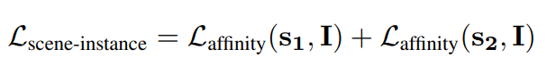

## 2.1.3. Instance to instance
Here, optimal transport has been used to match instance representations, the more similar ones are pulled together. Without getting into the details, here we try to map K online instance representations to K target instance representations. If two nodes (representations) are more similar they will produce less transportations cost (which will be minimized by the model). 

To calculate the loss costs between nodes will be multiplied by the optimal transportation plan. Costs between nodes can be found with the cosine similarity between representations, the more similar the less the cost:

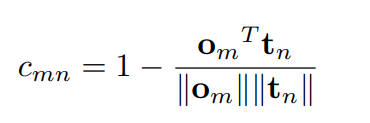

Finding the optimal transportation plan is achieved with a fast iterative approach called Sinkhorn-Knopp iteration. This part was not clearly explained in the paper but the paper OTA explains it better[]. First we need to find the supplier and demander marrginal weights with:

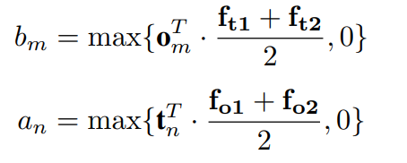

The iterative formula then uses these values to itertively find the optimal plan Y. If Y is found the loss is:

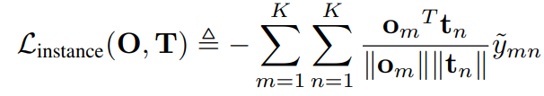

Where the final loss turns out to be:

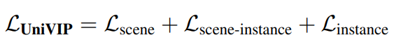

## 2.2. Our interpretation 

@TODO: Explain the parts that were not clearly explained in the original paper and how you interpreted them.

# 3. Experiments and results

## 3.1. Experimental setup

@TODO: Describe the setup of the original paper and whether you changed any settings.

## 3.2. Running the code

@TODO: Explain your code & directory structure and how other people can run it.

## 3.3. Results

I could not produce results due to:

Long train time
Hard to debug
Bugs faced

# 4. Conclusion

@TODO: Discuss the paper in relation to the results in the paper and your results.

# 5. References

@TODO: Provide your references here.

# Contact

Name: Utku Mert Topçuoğlu
email: utkumerttopcuoglu@gmail.com
